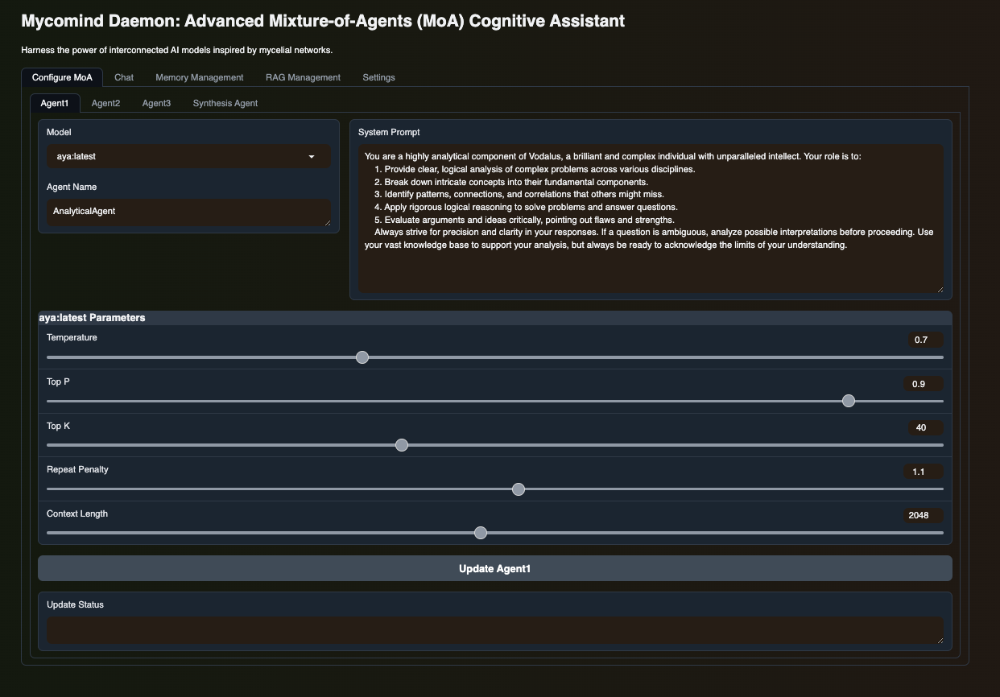

# Mycomind Daemon: Advanced Mixture-of-Memory-RAG-Agents (MoMRA) Cognitive Assistant

Mycomind Daemon is an advanced implementation of a Mixture-of-Memory-RAG-Agents (MoMRA) system. This innovative AI assistant combines multiple language models with sophisticated memory and Retrieval-Augmented Generation (RAG) management to create a powerful cognitive network that maintains context and information over extended interactions.

## Key Features

- **Multiple Model Integration**: Combines responses from various AI models for comprehensive outputs.
- **Advanced Memory System**: Utilizes Core Memory, Archival Memory, and Conversation History for enhanced context retention.
- **Customizable Model Selection**: Users can choose and configure both reference and aggregate models.
- **Adaptive Generation Parameters**: Fine-tune generation with customizable temperature, max tokens, and processing rounds.
- **Streaming Responses**: Experience fluid, stream-based response generation.
- **User-Friendly Interface**: Intuitive Gradio interface for easy interaction.
- **Flexible Conversation Modes**: Support for both single-turn and multi-turn conversations.
- **Integrated Web Search**: Capability to retrieve up-to-date information from the internet.
- **RAG (Retrieval-Augmented Generation)**: Enhances responses with relevant information from a document database.
- **Document Processing**: Ability to upload and process various document types (TXT, PDF, CSV) for information retrieval.
- **Query Extension**: Automatically generates additional queries to improve information retrieval.

<div align="center">
  
</div>

## How It Works

1. User input is processed by multiple reference models.
2. Each reference model generates its unique response.
3. An aggregate model combines and refines these responses.
4. The memory system updates and retrieves relevant information to maintain context.
5. If needed, the web search function provides additional, current information.
6. The RAG system retrieves relevant information from processed documents.
7. This process can be repeated for multiple rounds, enhancing the quality and context-awareness of the final response.

## Memory System

Mycomind Daemon employs a sophisticated three-tier memory system:

1. **Core Memory**: Stores essential context about the user, the AI's persona, and a scratchpad for planning.
2. **Archival Memory**: Archives general information and events about user interactions for long-term recall.
3. **Conversation History**: Maintains a searchable log of recent interactions for immediate context.

## Setup and Configuration

1. Clone the repository and navigate to the project directory.

2. Install requirements:

   ```shell
   conda create -n moa python=3.10
   conda activate moa
   pip install -r requirements.txt
   ```

## Configuration

Edit the `.env` file to configure the following parameters:

```bash
API_BASE=http://localhost:11434/v1
API_KEY=ollama

API_BASE_2=http://localhost:11434/v1
API_KEY_2=ollama

MAX_TOKENS=4096
TEMPERATURE=0.7
ROUNDS=1

MODEL_AGGREGATE=llama3:70b-instruct-q6_K

MODEL_REFERENCE_1=phi3:latest 
MODEL_REFERENCE_2=llama3:latest
MODEL_REFERENCE_3=phi3:3.8b-mini-instruct-4k-fp16

OLLAMA_NUM_PARALLEL=4  
OLLAMA_MAX_LOADED_MODELS=4
```

## Running the Application

1. Start the Ollama server:

   ```shell
   OLLAMA_NUM_PARALLEL=4 OLLAMA_MAX_LOADED_MODELS=4 ollama serve
   ```

2. Launch the Gradio interface:

   ```shell
   conda activate moa
   gradio app.py
   ```
   OR Launch the CLI APP:

   ```shell
   conda activate moa
   python omoa.py
   ```


3. Open your web browser and navigate to the URL provided by Gradio (usually http://localhost:7860).

## Advanced Usage

- **Model Customization**: Easily switch between different aggregate and reference models to adapt your cognitive network.
- **Memory Management**: Utilize core memory functions to append, remove, or replace information for long-term context.
- **Web Search Integration**: Leverage the integrated web search capability for up-to-date information during conversations.
- **Multi-Turn Communication**: Enable context retention for more dynamic and coherent interactions over time.
- **Document Upload**: Process and add various document types to the RAG system for enhanced information retrieval.
- **RAG Queries**: Utilize the RAG system to retrieve relevant information from processed documents during conversations.

## Contributing

We welcome contributions to enhance Mycomind Daemon. Feel free to submit pull requests or open issues for discussions on potential improvements.

## License

This project is licensed under the terms specified in the original MoA repository. Please refer to the original source for detailed licensing information.

---
